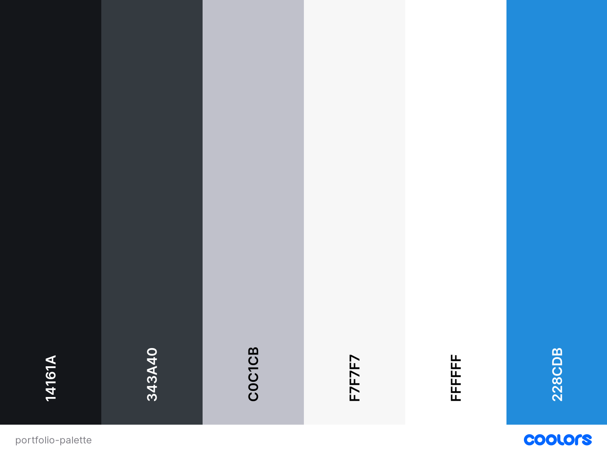

# Personal Portfolio

## Table of Contents

> -	[Overview](#overview)
> -	[Description](#description)
> -	[UX](#user-experience)
> -	[Features](#features)
> -	[Technologies Used](#technologies-used)
> -	[Testing](#testing)
> - [Deployment](#deployment)
> -	[Credits](#credits)
> - [Acknowledgements](#acknowledgements)

## Overview

This is my personal portfolio, designed to showcase work I've done and demonstrate my skills in web development. 

## Description

My portfolio is a one-page website to showcase my work and skills to recruiters and employers, as well as potential clients for freelance work. It shares relevant information about me and my background, displays examples of past work and has multiple methods of contact for anyone who wants to get in touch.

## Target Audience

The target audience for my personal portfolio is potential employers and recruiters, as well as potential clients, to enable them to see a summary of my skills, background and experience, and view examples of my work.

## Business Objectives

* To clearly demonstrate my skills and suitablility for job roles, as well as showcase my past work
* To attract employers and recruiters in order to gain offers of employment
* To attract potential clients for offers of freelance commission work
* To provide a personal online space to track and update my progress as a developer

## User Objectives

* To obtain a clear and concise personal background for a potential employee
* To accurately assess individual skills and capabilities, combined with relevant experience
* To view examples of previous work, projects and coding ability

## User Experience
## Structure

The website is one page, split into four main sections - home, about, portfolio and contact. The fixed navigation buttons allow the use to easily navigate the site. The Home section displays a prominent hero image which scales down on tablets and is hidden on mobiles, and a clear site message. The About section provides more detailed information, as well as listing appropriate skills. The Portfolio section is clean and simple, presenting examples of past work with links to both the source code and live deployed sites. The Contact page presents four ways of getting in touch - via email, phone, LinkedIn messaging or via the in-built contact form, which sends a direct email via the EmailJS API.

## Skeleton
## Surface

### Images

Portfolio images generated using [AmIResponsive?](https://ui.dev/amiresponsive) as part of original project submissions. 

### Colours

Colours were largely chosen to present a clean, easily-navigated, professional site, with nods to previous work (I use blue a lot!). Night provides the main font colour. Onyx provides the 'dark mode' background color. French Grey is used as the progress bar background. Seasalt provides the main off-white 'light mode' background colour. White is used where appropriate for fonts, icons and background colour. Tufts Blue is the main accent colour used for buttons, highlight text, borders etc. Dark Cornflower Blue is used as a complimentary colour to the main brand blue, used for hover effects and occasional font colour.

* Night (#14161A)
* Onyx (#343A40)
* French Grey (#C0C1CB)
* Seasalt (#F7F7F7)
* White (#FFFFFF)
* Tufts Blue (#228CDB)

### Typography

[Libre Franklin](https://fonts.google.com/specimen/Libre+Franklin?query=Libre+Franklin) was chosen for the main content font, as it is easy to read and has plenty of styling options. [Clicker Script](https://fonts.google.com/specimen/Clicker+Script?query=Clicker+Script) was chosen to generate the cursive text effect. 

### Icons

Appropriate icons across the site were taken from [Font Awesome](https://fontawesome.com/). These add important visual cues for users, especially on mobile devices. 

## Technologies Used

#### Languages:
* [HTML](https://en.wikipedia.org/wiki/HTML)
* [CSS](https://en.wikipedia.org/wiki/CSS)
* [JavaScript](https://en.wikipedia.org/wiki/JavaScript)

#### Libraries & Frameworks:
* [Balsamiq](https://balsamiq.com/) - Used for the creation of wireframes.
* [FontAwesome](https://fontawesome.com/) - Used for all site icons.
* [JQuery](https://jquery.com) - The project uses JQuery to simplify DOM manipulation.
* [GoogleFonts](https://fonts.google.com/) - 'Syncopate' and 'Raleway' fonts.

#### APIs:
* [EmailJS](https://www.emailjs.com/) - Allows the Contact Form to send emails directly to the site owner.

#### Version Control:
* [Github](https://github.com/) - Used to store the code 
* [Gitpod](https://gitpod.io/) - Used as the primary version control IDE for development to further push and commit code to GitHub.

#### Other:
* [Stack Overflow](https://stackoverflow.com/) - Used for general troubleshooting and examples.
* [ChromeDevTools](https://developers.google.com/web/tools/chrome-devtools) - Used frequently to detect any issues/bugs or layout differences.
* [Coolors](https://coolors.co/) - Used to help define the site colour scheme.
* [ami.responsive](http://ami.responsivedesign.is/) - Used to generate multi-device mockup image.
* [Clippy](https://bennettfeely.com/clippy/) - Used to create polygon clip path
* [Remove BG](https://www.remove.bg/upload) - Used to remove background from images
* [amiresponsive](https://ui.dev/amiresponsive) - Used to generate multi-device mockup image.

## Testing
## Deployment
## Credits
## Acknowledgements